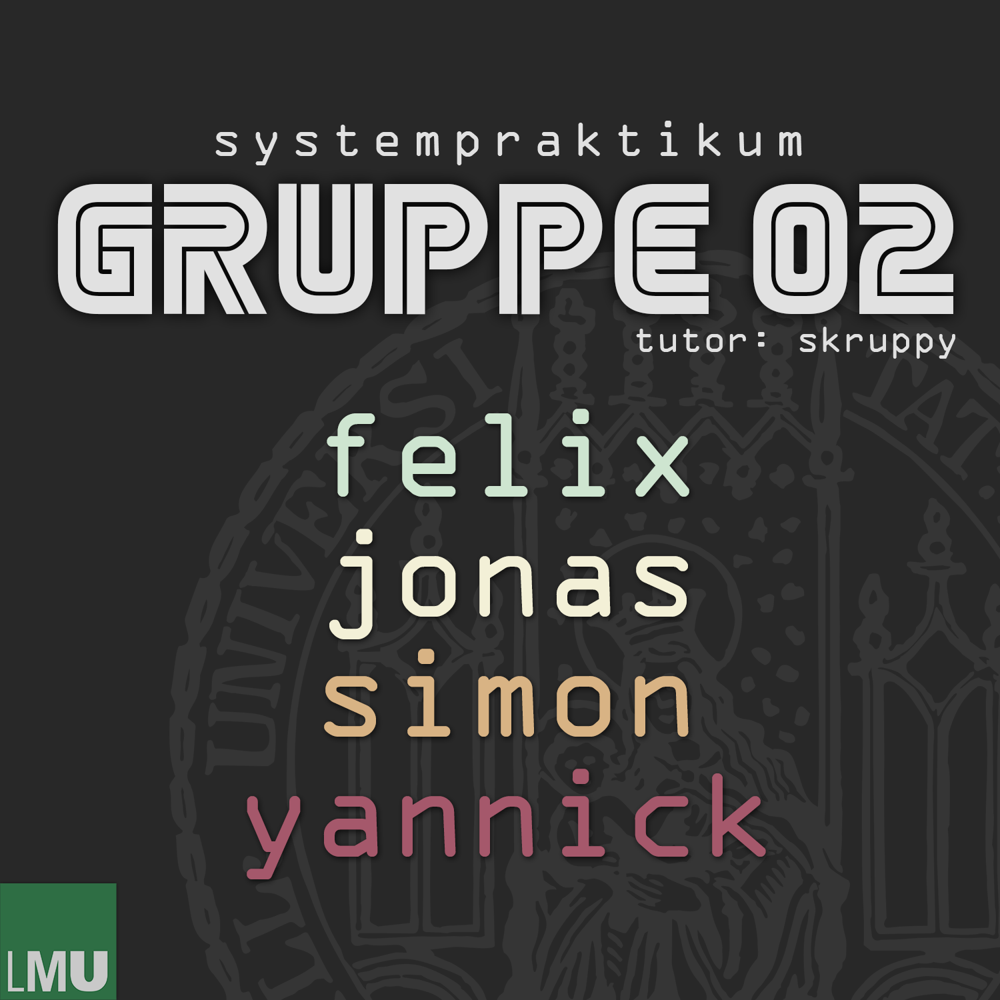

# quarto-client


## Usage

Compile:

```bash
make
```

Run:

```bash
./sysprak-client
```

Compile & run if compiling was successful:

```bash
# by providing a specific game:
GAME_ID=1234567890123 PLAYER=1 make play
# by automatically creating a game:
make play-new
```

